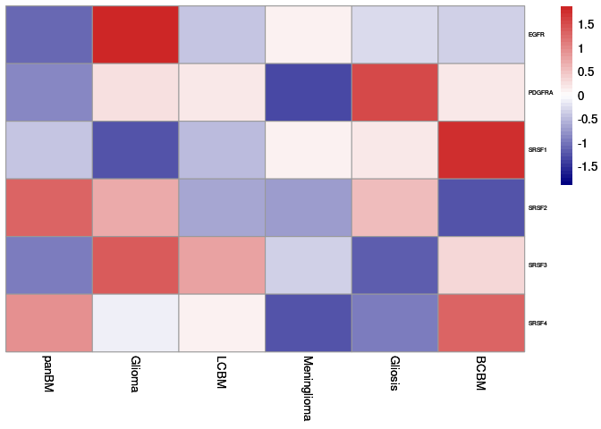

<!-- README.md is generated from README.Rmd. Please edit that file -->

# SpliceDigger

<!-- badges: start -->

[](https://www.r-project.org/logo/)

<!-- badges: end -->

The goal of SpliceDigger is to provide an intuitive and comprehensive toolkit for the analysis and visualization of alternative splicing events across various biological conditions or experiments. SpliceDigger aims to help users uncover insights into the dynamics of splicing regulation by integrating statistical analyses and customizable visualization capabilities with ease of use.

Using SpliceDigger, researchers can:

    Identify splicing events: Detect and quantify different types of splicing events (e.g., exon skipping, alternative donor/acceptor sites, intron retention) across transcriptomic datasets.
    Perform comparative analyses: Highlight splicing differences between conditions, tissues, or time points to understand functional significance and splicing regulation.
    Visualize splicing patterns: Generate clean and informative visualizations, such as heatmaps, sashimi plots, bar plots, and splicing landscape summaries, to present splicing events in a biological context.
    Integrate functional insights: Annotate splicing events with gene ontology information or additional functional annotations to connect splicing regulation to pathways and phenotypes.

What sets SpliceDigger apart is its focus on providing flexible and user-friendly workflows for processing splicing data, along with customizable plotting features to allow researchers to tailor visual outputs according to their project's needs.

## Installation

You can install the development version of SpliceDigger from [GitHub](https://github.com/) with:

``` r
# install.packages("devtools")
devtools::install_github("LUCAXXSS/SpliceDigger")
```

## Example

This is a basic example which shows you how to make use of SpliceDigger:

``` r
library(SpliceDigger)
#> Loading required package: data.table
#> Loading required package: dplyr
#> 
#> Attaching package: 'dplyr'
#> The following objects are masked from 'package:data.table':
#> 
#>     between, first, last
#> The following objects are masked from 'package:stats':
#> 
#>     filter, lag
#> The following objects are masked from 'package:base':
#> 
#>     intersect, setdiff, setequal, union
#> Loading required package: ggplot2
## basic example code
SD.obj <- SpliceDigger.create_SD_object(ENST_table = iso_tpm_You_etal_2025,exp_table= exp_You_etal_2025)
SD.obj <- SpliceDigger.add_annotation(SD.obj,dataanno_You_etal_2025)

SD.obj <- SpliceDigger.filter_SDobject(SD.obj,AS_threshold = 0.2,AS_var_topn = 5000,exp_threshold = 20,exp_var_topn = 5000)

SD.obj <- SpliceDigger.calculate_tSNE(SD.obj,use_data = "iso_exp_pct_filtered",tSNE_perplexity = 15,kmeans_centers = 3,seed = 4401)

SpliceDigger.plot_tSNE(SD.obj,plot_dataset ="iso_exp_pct_filtered",anno_to_show = "iso_exp_pct_filtered_kmeans_cluster")
```


``` r


df <- SpliceDigger.findMarkers(SD.obj,anno_to_use = "iso_exp_pct_filtered_kmeans_cluster",cluster_to_check = "cluster_3",only.pos = T)
#> Using classic mode.


SpliceDigger.visualize_AS_transcript(SD_object = SD.obj,anno_to_use = "iso_exp_pct_filtered_kmeans_cluster",
                                     anno_to_demo = "cluster_3",feature = "SEC61G",
                                     feature_type = "Symbol",
                                     calculate_method = "mean",color = "#DC0000")
#> Warning: Removed 6 rows containing missing values (`position_stack()`).
```


``` r

SpliceDigger.visualize_exp_heatmap(SD_object = SD.obj,use_data = "exp_raw",FDR_threshold = 0.05,
                                   anno_to_use = "sort",feature_to_plot = c("EGFR","PDGFRA","SRSF1","SRSF2","SRSF3","SRSF4"))
#> Using classic mode.
#> Using classic mode.
#> Using classic mode.
#> Using classic mode.
#> Using classic mode.
#> Using classic mode.
```



``` r
SpliceDigger.plot_GSEA(SD_object=SD.obj,use_data="exp_raw",                                        anno_to_use="iso_exp_pct_filtered_kmeans_cluster", 
                        cluster_to_check="cluster_2",
                        topn=20,
                        msigdbr_species = "Homo sapiens",                                               msigdbr_category="C2",
                        msigdbr_subcategory="CP:WIKIPATHWAYS",
                        gsea_pvalue=0.05,plot=T,color="#DC0000")
```

``` r
 SpliceDigger.plot_GSEA_ridgeplot(SD_object=SD.obj,use_data="exp_raw",                                  anno_to_use="iso_exp_pct_filtered_kmeans_cluster",
                                  cluster_to_check="cluster_2",
                                  topn=20,
                                  custom=F,
                                  msigdbr_species = "Homo sapiens",                                             msigdbr_category="H",
                                  msigdbr_subcategory=NULL,
                                  geneset_to_plot="HALLMARK_ANGIOGENESIS")
#> Using classic mode.
#> [1] 37514
#> 
#> preparing geneSet collections...
#> GSEA analysis...
#> leading edge analysis...
#> done...
```


The psi(percentage splice-in) files can also be intergraded into SpliceDigger pipeline

``` r

SD.obj <- SpliceDigger.add_SUPPA2_psi(SD_object=SD.obj,psi_matrix=psi_You_etal_2025)

SpliceDigger.plot_AS_pieplot(SD_object=SD.obj,return_pie_plot=T,anno_to_use="iso_exp_pct_filtered_kmeans_cluster",cluster_to_check="cluster_2")
```


``` r
                                         
SpliceDigger.plot_gene_AS_pieplot(SD_object=SD.obj,gene_to_use=c("EGFR"),anno_to_use="sort",cluster_to_check="BCBM")                                           
```


